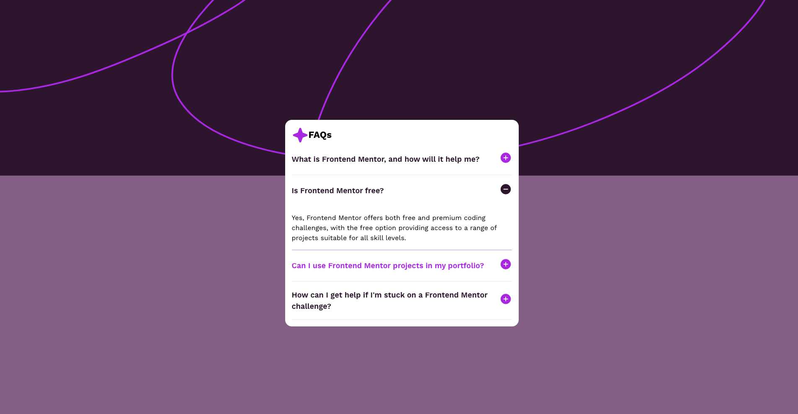

# Frontend Mentor - FAQ Accordion Solution

This is my solution to the [FAQ Accordion Challenge on Frontend Mentor](https://www.frontendmentor.io/challenges/faq-accordion-wyfFdeBwBz). Frontend Mentor challenges are a great way to enhance your coding skills by building real-world projects.

## Table of Contents

- [Overview](#overview)
  - [The Challenge](#the-challenge)
  - [Screenshot](#screenshot)
  - [Links](#links)
- [My Process](#my-process)
  - [Built With](#built-with)
  - [What I Learned](#what-i-learned)
  - [Continued Development](#continued-development)
  - [Useful Resources](#useful-resources)
- [Author](#author)

---

## Overview

### The Challenge

Users should be able to:

- Hide/Show the answer to a question when the question is clicked.
- Use keyboard navigation to toggle questions and answers.
- View an optimal layout for the FAQ interface based on device screen size.
- See hover and focus states for all interactive elements on the page.

### Screenshot



> Screenshot captured during the project completion phase. It demonstrates both the closed and expanded states of the accordion.

### Links

- **Solution CODE:** [View Solution Code](https://github.com/Patrycja-dz/faq_frontend_mentor)
- **Live Site URL:** [View Live Site](https://patrycja-dz.github.io/faq_frontend_mentor/)

---

## My Process

### Built With

- **Semantic HTML5** markup
- **CSS custom properties** for consistent styling
- **Flexbox** for layout
- **CSS Grid** for responsive design
- **Mobile-first workflow**
- Animations using **CSS transitions**

### What I Learned

Working on this project helped me improve my understanding of:

1. **HTML `details` and `summary` elements**:

   ```html
   <details>
     <summary>What is Frontend Mentor?</summary>
     <p>Frontend Mentor offers coding challenges to improve your skills.</p>
   </details>
   ```

2. **CSS Transitions for Interactive UI**:

   ```css
   summary:hover {
     background-image: linear-gradient(
       to right,
       #54b3d6,
       hsl(292, 16%, 49%),
       #ad28eb 50%
     );
     -webkit-text-fill-color: transparent;
     transition: all 1s ease-in-out;
   }
   ```

### Continued Development

In future projects, I plan to:

- Explore JavaScript-based accordion implementations for finer control and customization.
- Integrate advanced accessibility features like ARIA roles.
- Implement a search or filter functionality within the FAQ to allow quick access to relevant questions.

### Useful Resources

- [MDN Web Docs - Details and Summary](https://developer.mozilla.org/en-US/docs/Web/HTML/Element/details) - Helped me understand the semantic structure and usage of `<details>` and `<summary>` elements.
- [Kevin Powell video - Animate details & summary](https://www.youtube.com/watch?v=Vzj3jSUbMtI) - Provided a great tutorial on animating the `<details>` and `<summary>` elements.
- [CSS Weekly channel - animate HTML details](https://www.youtube.com/watch?v=idoaw75xjhU&t=0s)

---

## Author

- **Frontend Mentor Profile:** [@Patrycja](https://www.frontendmentor.io/profile/Patrycja-dz)
